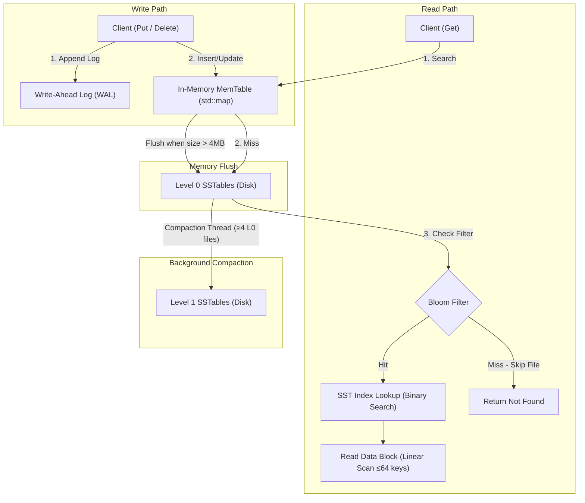

# MiniLevelDB — LSM Storage Engine


**MiniLevelDB** is a lightweight, embedded Log-Structured Merge-tree (LSM-tree) key-value storage engine implemented in modern **C++17**. Inspired by the architectures of **LevelDB** and **RocksDB**, MiniLevelDB is designed to handle write-heavy workloads efficiently while offering fast read access through SSTable indexing, probabilistic Bloom filters, and background compaction.

---

## 🌟 Key Features

- ⚡ **High Write Throughput**: Converts random writes into fast, sequential disk writes using an in-memory buffer (MemTable) paired with an append-only Write-Ahead Log (WAL).
- 🛡️ **Crash Recovery via WAL**: On startup, automatically replays the Write-Ahead Log to restore any un-flushed MemTable data that was not yet written to an SSTable.
- 🔒 **Thread-Safe Architecture**: A `std::mutex` in `DBImpl` serializes all `Put`, `Get`, and `Delete` operations. The MemTable additionally uses a `std::shared_mutex` for fine-grained read-write separation at the memory layer.
- 💾 **Sparse-Indexed SSTables (Sorted String Tables)**: Flushes sorted key-value data to disk with a sparse block index (one entry per 64 keys) for efficient binary search retrieval.
- 🌸 **Probabilistic Bloom Filters**: Embedded per SSTable to eliminate unnecessary disk reads for non-existent keys, minimizing Read Amplification. Sized using the optimal formula for a 1% false positive rate.
- 🔄 **Background Compaction Engine**: Runs a dedicated background thread (`BackgroundCompactionLoop`) to merge L0 SSTables into L1 when L0 accumulates 4 or more files, deduplicating keys and purging tombstones.
- 📊 **Real-time Telemetry & Metrics**: Native performance counters (`Metrics` singleton & `ScopedTimer`) measuring:
  - **Write Amplification Factor (WAF)**
  - **Bloom Filter Drop Rate**
  - **P99 Put & Get Latency (microseconds)**
  - **Disk I/O Bytes Written**
- 🧪 **Benchmarking & Testing**: Ships with GoogleTest suites for functionality verification and Google Benchmark microbenchmarks for performance analysis under sequential and random-key workloads.

---

## 🏗️ Storage Engine Architecture

The architecture follows standard Log-Structured Merge-tree principles:



### Component Breakdown

| Component | Responsibility | Technical Details |
| :--- | :--- | :--- |
| **`MemTable`** | Write buffer in RAM | Backed by `std::map` (Red-Black Tree, sorted), thread-safe via `std::shared_mutex` |
| **`WAL`** | Crash recovery log on disk | Sequential append-only binary file; replayed into MemTable on startup |
| **`SSTableBuilder`** | Writes sorted KV data to disk | Constructs sorted data records, sparse index block, Bloom filter, and 16-byte footer |
| **`SSTableReader`** | Reads SSTables from disk | Loads index and Bloom filter into memory at construction; data blocks stay on disk |
| **`BloomFilter`** | Probabilistic membership check | Multi-hash bit-array with math-derived sizing (default 1% false positive rate) |
| **`CompactionJob`** | L0 → L1 SSTable merging | Merges all L0 files into one L1 file; deduplicates and drops tombstones |
| **`Metrics`** | Engine telemetry | Atomic counters for bytes and SSTable queries; mutex-protected latency vectors for P99 |

---

## 📁 Repository Structure

```
MiniLevelDB/
├── CMakeLists.txt            # Main CMake build configuration (Fetches GTest & GBenchmark)
├── include/                  # Public Header Files
│   ├── bloom_filter.h        # Probabilistic filter declaration
│   ├── compaction_job.h      # Multi-SSTable merging interface
│   ├── db_impl.h             # Core DBImpl engine interface
│   ├── memtable.h            # In-memory map-based table
│   ├── metrics.h             # Telemetry & P99 latency tracking
│   ├── sstable_builder.h     # SSTable disk builder
│   ├── sstable_reader.h      # SSTable disk reader & index lookup
│   └── wal.h                 # Write-Ahead Log interface
├── src/                      # Implementation Files
│   ├── CMakeLists.txt
│   ├── core/
│   │   └── db_impl.cpp       # Main database logic & background compaction worker
│   ├── mem/
│   │   ├── memtable.cpp      # MemTable read/write operations
│   │   └── wal.cpp           # WAL logging & crash recovery
│   ├── disk/
│   │   ├── bloom_filter.cpp  # Bit vector & multi-hashing implementation
│   │   ├── sstable_builder.cpp # Disk block serialisation
│   │   └── sstable_reader.cpp  # SSTable deserialisation & binary search
│   ├── compaction/
│   │   └── compaction_job.cpp # L0 → L1 merge-sort compaction
│   └── telemetry/
│       └── metrics.cpp       # Telemetry aggregation & latency calculations
├── tests/
│   ├── CMakeLists.txt
│   └── test_main.cpp         # GoogleTest suite (Put/Get, Delete, WAL recovery, Flush)
└── benchmarks/
    ├── CMakeLists.txt
    └── bench_main.cpp        # Google Benchmark suite (Write amp, P99 latency, Bloom Filter efficiency)
```

---

## 🚀 Quick Start & Usage

### C++ Example

```cpp
#include "db_impl.h"
#include "metrics.h"
#include <iostream>

int main() {
    // 1. Initialize DB at path
    minidb::DBImpl db("./data_dir");

    // 2. Insert Key-Value pairs
    db.Put("user_1001", "Alice");
    db.Put("user_1002", "Bob");

    // 3. Retrieve values
    auto val = db.Get("user_1001");
    if (val.has_value()) {
        std::cout << "Found user_1001: " << val.value() << std::endl;
    }

    // 4. Update / Delete keys
    db.Delete("user_1002");

    // 5. Inspect Engine Telemetry
    auto& metrics = minidb::Metrics::GetInstance();
    std::cout << "Write Amplification: " << metrics.GetWriteAmplification() << std::endl;
    std::cout << "P99 Put Latency (us): " << metrics.GetP99PutLatency() << std::endl;

    return 0; // Automatic close, flushes MemTable & gracefully stops compaction thread
}
```

---

## 🛠️ Building & Running on WSL (Linux)

### 1. Prerequisites (WSL / Ubuntu)

Install standard C++ build tools, GCC, CMake, and Git inside WSL:

```bash
sudo apt update
sudo apt install -y build-essential cmake git g++
```

### 2. Building from Source (WSL Terminal)

Navigate to your workspace directory inside WSL and compile using CMake:

```bash
# Navigate to the project directory
cd MiniLevelDB

# Create and configure build directory
mkdir -p build && cd build
cmake -DCMAKE_BUILD_TYPE=Release ..

# Compile target binaries using all CPU cores
make -j$(nproc)
```

### 3. Running Unit Tests in WSL

Unit tests are built using **GoogleTest** (automatically fetched via CMake):

```bash
# From the build directory:
ctest --output-on-failure

# Or run the GoogleTest binary directly:
./tests/minidb_tests
```

### 4. Running Microbenchmarks in WSL

Microbenchmarks are powered by **Google Benchmark**:

```bash
# From the build directory:
./benchmarks/minidb_bench
```

---

## 💻 Building Native Windows (Powershell / Command Prompt)

### Prerequisites
- **C++ Compiler**: `GCC` (MinGW), `Clang`, or `MSVC 2019+`
- **CMake**: `v3.14` or higher

```powershell
# Navigate to project directory
cd MiniLevelDB

# Configure & build with CMake
cmake -B build -S .
cmake --build build --config Release

# Run tests
cd build
ctest --output-on-failure
.\tests\minidb_tests.exe

# Run benchmarks
.\benchmarks\minidb_bench.exe
```

---

## 📈 Benchmark Results & Performance Profile

Benchmarks run on: **12-core CPU @ 2496 MHz**, L1=48KiB×6, L2=1280KiB×6, L3=12MB

### BM_LSM_HeavyWrite — 10,000 Sequential Inserts (256-byte values, 10 iterations)

```
Benchmark                    Time        CPU    Iterations
BM_LSM_HeavyWrite/10000    311 ms     34.2 ms      10

Disk_Bytes_Written    = 30.47 MB
WriteAmplification    = 1.10x
BloomFilterDropRate   = 0        (expected — benchmark reads only existing keys)
p99_Get_Latency_us    = 0.835 µs
p99_Put_Latency_us    = 960.065 µs
```

### Performance Analysis

| Metric | Result | Engineering Insight |
| :--- | :--- | :--- |
| **Wall Time vs CPU Time** | `311 ms` wall / `34.2 ms` CPU | 9× gap — program is I/O-bound, not CPU-bound. Most time is spent waiting on SSTable flush disk writes. |
| **Write Amplification** | `1.10×` | Low because the same 10k keys are overwritten 10 times; MemTable absorbs repeated updates before flushing. Measured as total disk bytes / WAL bytes. |
| **P99 Get Latency** | `0.835 µs` | Reads hit the in-memory MemTable directly. Cold-disk reads (SSTable lookup on NVMe) would be ~100–200× slower. |
| **P99 Put Latency** | `960 µs` | Tail latency is caused by occasional MemTable flush write stalls — the 1% of `Put()` calls that trigger a synchronous SSTable file write. |
| **Bloom Filter Drop Rate** | `0` | This benchmark reads existing keys. The filter correctly returns "possibly present" for all of them. Run `BM_LSM_RandomBottleneck` with missing keys to observe non-zero drop rates. |
| **Total Disk I/O** | `30.47 MB` | ~27.6 MB WAL records + ~2.9 MB SSTable flush overhead (index, bloom filter, footer). |

---

## 📊 Performance & Telemetry Metrics

MiniLevelDB features built-in telemetry to monitor key LSM engine health indicators:

- **Write Amplification Factor (WAF)**: Ratio of total bytes written to disk (WAL + SSTable flushes + compaction output) to WAL bytes written. A lower value indicates less write overhead.
- **Bloom Filter Drop Rate**: Fraction of SSTable file opens skipped by the Bloom filter. Most meaningful when measured against a missing-key workload.
- **P99 Latency**: Microsecond-level 99th percentile latency tracking for `Put` and `Get` calls via RAII `ScopedTimer`.
- **Disk Bytes Written**: Total raw bytes written to disk across WAL, SSTable flush, and compaction.

---

## ⚠️ Known Limitations

- **2-level LSM only**: Compaction runs L0 → L1. L1 has no size limit and does not compact further. Production engines (LevelDB, RocksDB) use 6–7 levels.
- **Single global mutex**: All `Put` and `Get` operations are serialized through one `std::mutex` in `DBImpl`. No concurrent reads.
- **In-memory compaction merge**: All L0 files are loaded into a `std::map` during compaction. RAM usage scales with total L0 data size.
- **No transaction support**: Each `Put`/`Delete` is its own atomic operation. Multi-key transactions are not supported.
- **SSTable manifest not persisted**: On restart, existing SSTable files on disk are not reloaded. Only WAL replay is used for recovery.

---

## 📜 License

This project is open-source software licensed under the **MIT License**.
